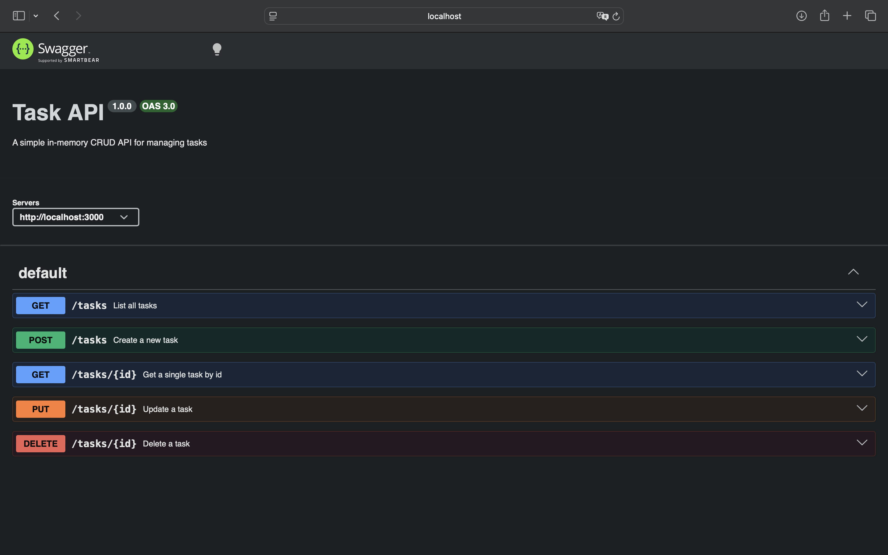

# Task API

A small in-memory CRUD API for managing a to-do list, built with Node.js and Express.

## Features
- Full CRUD (Create, Read, Update, Delete) on tasks
- In-memory storage (no database — data resets when the server restarts)
- Interactive API docs via Swagger UI

## Installation & Running

1. Clone this repo:
```bash
   git clone https://github.com/lynngoh7/tiny-server.git
   cd tiny-server
```

2. Install dependencies:
```bash
   npm install
```

3. Start the server:
```bash
   node server.js
```

4. The server runs at `http://localhost:3000`.

## Endpoints

| Method | Path         | Description                  | Success | Errors        |
|--------|--------------|-------------------------------|---------|---------------|
| GET    | `/`          | API info                     | 200     | —             |
| GET    | `/health`    | Health check                 | 200     | —             |
| GET    | `/tasks`     | List all tasks               | 200     | —             |
| GET    | `/tasks/:id` | Get a single task            | 200     | 404           |
| POST   | `/tasks`     | Create a new task            | 201     | 400           |
| PUT    | `/tasks/:id` | Update a task                | 200     | 400, 404      |
| DELETE | `/tasks/:id` | Delete a task                | 204     | 404           |

## Example request

```bash
curl -i -X POST http://localhost:3000/tasks \
  -H "Content-Type: application/json" \
  -d '{"title":"Buy milk"}'
```

```
HTTP/1.1 201 Created
X-Powered-By: Express
Content-Type: application/json; charset=utf-8
Content-Length: 40
ETag: W/"28-PpSBYV7i68cXyGc7AhjVpkZkY5Q"
Date: Thu, 16 Jul 2026 03:34:54 GMT
Connection: keep-alive
Keep-Alive: timeout=5

{"id":4,"title":"Buy milk","done":false}
```

## Swagger UI

Interactive docs are available at `http://localhost:3000/docs` once the server is running.



## Notes
- Data is stored in memory only — restarting the server resets tasks back to the 3 seed examples. This is intentional; a real database is introduced in a later stage.